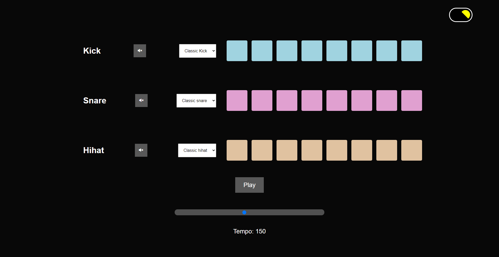

# Beat Maker

## Table of Contents:

- [Overview](#overview)
- [Purpose](#purpose)
- [Features](#features)
- [Website](#website)

## Overview

This beatmaker is my first JavaScript application using Object Oriented Programming! This project was inspired and helped from [Developed by Ed](https://www.youtube.com/channel/UClb90NQQcskPUGDIXsQEz5Q)

## Purpose

- This application will allow the user to click a few different 'pads' and chose their type of instrument to create and amazing beat!

## Features

- HTML
- CSS
- JavaScript
- Animations

## Website

[Deployed Beat Maker](https://ajcuddeback.github.io/beat-maker)

